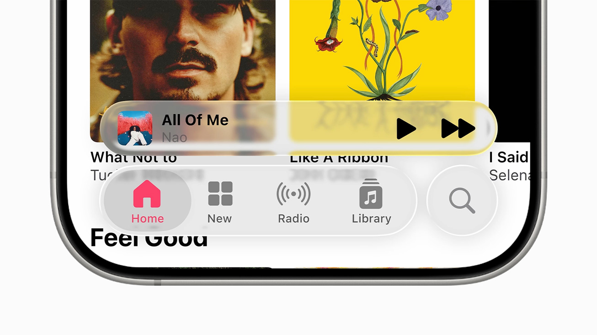
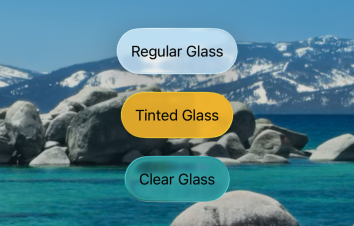
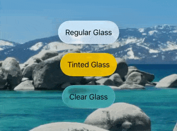
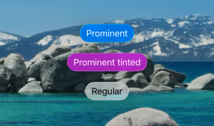
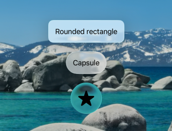
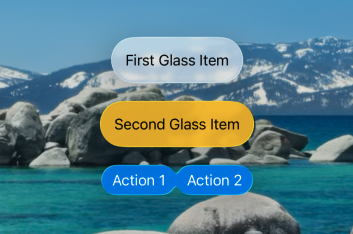
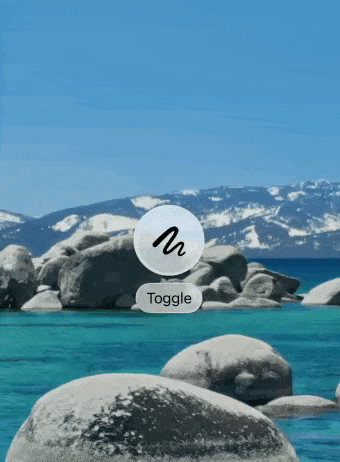
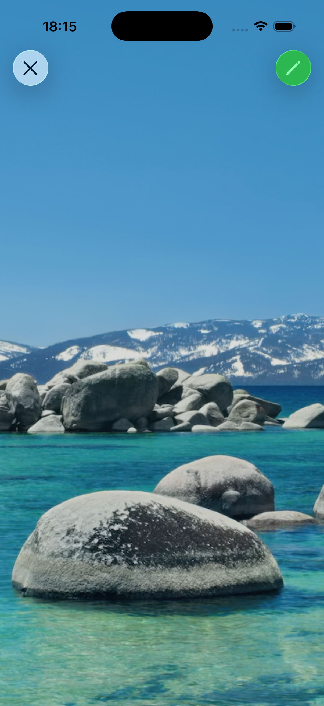
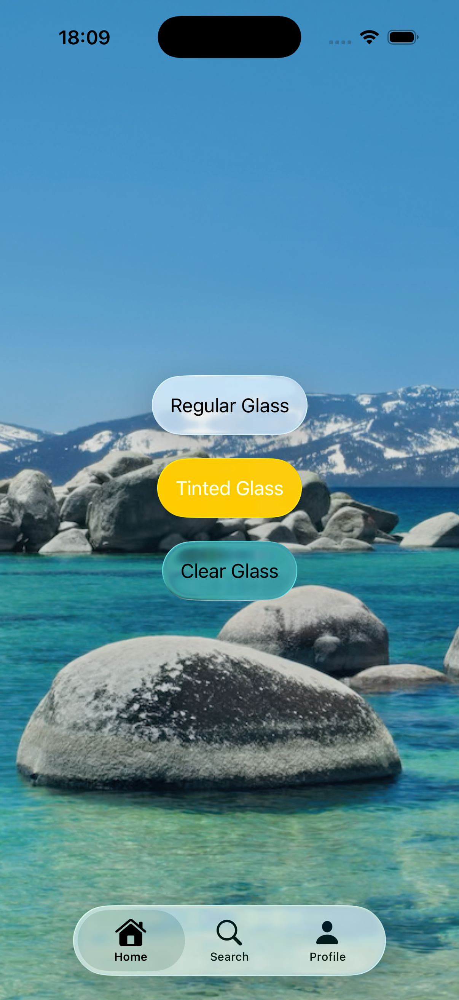
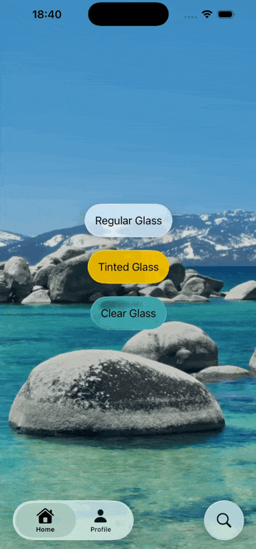

# Liquid Glass in SwiftUI - Complete Cheatsheet

## Overview

<div align="center">
  
</div>

This is a comprehensive cheatsheet containing everything you need to know about **Liquid Glass** - Apple's dynamic material design language introduced in 2025. Liquid Glass combines the optical properties of glass with fluid motion to create immersive and responsive user interfaces.

This cheatsheet covers all aspects of implementing Liquid Glass in SwiftUI, from basic effects to advanced features. Whether you're just getting started or looking for specific implementation details, you'll find practical examples and code snippets for every use case.

### Key Features of Liquid Glass:
- **Dynamic Blur & Reflection**: Refracts content beneath it and reflects ambient light
- **Lensing Effect**: Creates visual depth along edges
- **Real-Time Interaction**: Responds to user touches and hover states
- **Fluid Motion**: Smooth animations and transitions
- **Cross-Platform**: Available on iOS 26+, iPadOS 26+, macOS Tahoe+, tvOS 26+, and watchOS 26+

### Contributing
We welcome contributions to make this cheatsheet even better! If you discover new techniques, find errors, or want to add more examples, please:
- Open an issue to discuss your ideas
- Submit a pull request with your improvements
- Share additional use cases or best practices

Together, we can build the most comprehensive Liquid Glass resource for the SwiftUI community!

## Basic Implementation

### Simple Glass Effect

Apply the default Liquid Glass effect to any view:

```swift
import SwiftUI

struct ContentView: View {
    var body: some View {
        Text("Hello, Liquid Glass!")
            .padding()
            .glassEffect() // Applies the default glass effect with blur and reflection
    }
}
```

## Glass Effect Modifier

### Different styles

<div align="center">
  
</div>

SwiftUI provides different glass effect styles:

```swift
// Regular Glass - standard blur and reflection properties
Text("Regular Glass")
    .padding()
    .glassEffect(.regular)

// Tinted glass - adds color overlay to the glass effect
Text("Tinted Glass")
    .padding()
    .glassEffect(.regular.tint(.yellow))

// Clear glass - minimal blur for subtle transparency effect
Text("Clear Glass")
    .padding()
    .glassEffect(.clear)
```

### Interactive glass effects

<div align="center">
  
</div>

Make glass effects respond to user interactions:

```swift
// Regular Glass - standard blur and reflection properties
Text("Regular Glass")
    .padding()
    .glassEffect(.regular.interactive())

// Tinted glass - adds color overlay to the glass effect
Text("Tinted Glass")
    .padding()
    .glassEffect(.regular.tint(.yellow).interactive())

// Clear glass - minimal blur for subtle transparency effect
Text("Clear Glass")
    .padding()
    .glassEffect(.clear.interactive())
```

## Button styles

<div align="center">
  
</div>

Liquid glass provides two extra modifiers for the button styles:

```swift
// Prominent button with liquid glass - high emphasis with strong glass effect
Button("Prominent"){
    
}
.buttonStyle(.glassProminent)

// Prominent button with liquid glass tinted - adds accent color to prominent style
Button("Prominent tinted"){
    
}
.buttonStyle(.glassProminent)
.tint(.purple) // Apply custom tint color

// Standard liquid glass button - subtle glass effect for secondary actions
Button("Regular"){
    
}
.buttonStyle(.glass)
```

## Custom Shapes

<div align="center">
  
</div>

Create custom shapes when applying Liquid Glass:

```swift
// Apply glass effect to rounded rectangle shape
Text("Rounded rectangle")
    .padding()
    .glassEffect(.regular, in: .rect(cornerRadius: 12))

// Use capsule shape with continuous corner style for smooth curves
Text("Capsule")
    .padding()
    .glassEffect(.regular, in: .capsule(style: .continuous))

// Circular glass effect perfect for icons and symbols
Image(systemName: "star.fill")
    .font(.largeTitle)
    .padding()
    .glassEffect(.clear, in: .circle)
```

## Advanced Features

### Glass Effect Containers

<div align="center">
  
</div>

Use `GlassEffectContainer` to optimize performance when using multiple glass effects:

```swift
struct MultipleGlassView: View {
    var body: some View {
        // Container optimizes rendering performance for multiple glass effects
        GlassEffectContainer {
            VStack(spacing: 20) {
                // First glass element with standard effect
                Text("First Glass Item")
                    .padding()
                    .glassEffect(.regular)
                
                // Second element with tinted glass effect
                Text("Second Glass Item")
                    .padding()
                    .glassEffect(.regular.tint(.yellow))
                
                // Multiple buttons sharing the same container for efficiency
                HStack (spacing: 0) {
                    Button("Action 1") { }
                        .buttonStyle(.glassProminent)
                    
                    Button("Action 2") { }
                        .buttonStyle(.glassProminent)
                }
            }
        }
    }
}
```

### Morphing Transitions

<div align="center">
  
</div>

Create smooth morphing transitions between glass views:

```swift
@State private var isExpanded: Bool = false
@Namespace private var namespace // Namespace for coordinating glass effect transitions

var body: some View {
    ZStack {
        Image(.tahoe) // Background image
        
        VStack {
            // Container with custom spacing for glass elements
            GlassEffectContainer(spacing: 40.0) {
                HStack(spacing: 40.0) {
                    // First glass element with unique ID for morphing
                    Image(systemName: "scribble.variable")
                        .frame(width: 80.0, height: 80.0)
                        .font(.system(size: 36))
                        .glassEffect()
                        .glassEffectID("pencil", in: namespace) // ID enables smooth transitions
                    
                    // Conditionally shown element with its own glass ID
                    if isExpanded {
                        Image(systemName: "eraser.fill")
                            .frame(width: 80.0, height: 80.0)
                            .font(.system(size: 36))
                            .glassEffect()
                            .glassEffectID("eraser", in: namespace)
                    }
                }
            }
            
            // Control button with glass styling
            Button("Toggle") {
                withAnimation { // Animate the transition between states
                    isExpanded.toggle()
                }
            }
            .buttonStyle(.glass)
        }
    }
}
```

## Navigation

### Glass Navigation Bar

<div align="center">
  
</div>

By default SwiftUI now converts your navigation bar elements into Liquid Glass.

```swift
NavigationStack {
    ZStack {
        Image(.tahoe)
    }
    .toolbar{
        ToolbarItem(placement: .topBarLeading) {
            Button("Close", systemImage: "xmark") {
                
            }
        }
        
        ToolbarItem(placement: .topBarTrailing) {
            Button("Pencil", systemImage: "pencil") {
                
            }
            .buttonStyle(.glassProminent)
            .tint(.green)
        }
    }
}
```

### Glass Tab Bar
<div align="center">
  
</div>

By default SwiftUI now creates a Liquid Glass Tab View if run on iOS 26+ devices.

```swift
TabView(selection: $selectedTab) {
    // Home tab with glass effect content
    Tab("Home", systemImage: "house", value: 0) {
        GlassEffect()
    }
    
    // Search tab with interactive elements
    Tab("Search", systemImage: "magnifyingglass", value: 1) {
        InteractiveButtons()
    }
    
    // Profile tab with morphing glass animations
    Tab("Profile", systemImage: "person", value: 1) {
        MorphingGlassView()
    }
}
.tint(.black) // Sets the accent color for tab selection
```
### Glass tab bar with search button

<div align="center">
  

</div>
You can also add a separated button on the trailing corner. It's normally used for the search function but you can implement your own functionality.

```swift
struct GlassTabView: View {
    @State private var selectedTab = 0
    
    var body: some View {
        TabView(selection: $selectedTab) {
            // Standard home tab
            Tab("Home", systemImage: "house", value: 0) {
                GlassEffect()
            }
            
            // Search tab with special role creates floating search button
            Tab("Search", systemImage: "magnifyingglass", value: 1, role: .search) {
                SearchView()
            }
            
            // Profile tab
            Tab("Profile", systemImage: "person", value: 1) {
                MorphingGlassView()
            }
        }
        .tint(.black) // Accent color for the tab view
    }
}

struct SearchView: View {
    @State var search: String = ""
    
    var body: some View {
        NavigationStack {
            VStack {
                ContentUnavailableView("Search bar integrated in TabView", systemImage: "magnifyingglass")
            }
            .searchable(
                text: $search,
                placement: .toolbar, // Integrates with the glass navigation bar
                prompt: "Type here to search"
            )
        }
    }
}
```

## Resources and References

- [Adopting Liquid Glass - Apple Developer Documentation](https://developer.apple.com/documentation/technologyoverviews/adopting-liquid-glass)
- [SwiftUI Glass Effect Modifier Documentation](https://developer.apple.com/documentation/swiftui/view/glasseffect(_:in:))
- [WWDC 2025: Introducing Liquid Glass](https://developer.apple.com/videos/play/wwdc2025/101/)
- [Human Interface Guidelines - Materials](https://developer.apple.com/design/human-interface-guidelines/materials)

## Version Compatibility

| Platform | Minimum Version |
|----------|----------------|
| iOS      | 26.0           |
| iPadOS   | 26.0           |
| macOS    | Tahoe (26.0)   |
| tvOS     | 26.0           |
| watchOS  | 26.0           |

---

*This cheatsheet covers the essential aspects of implementing Liquid Glass in SwiftUI. For the most up-to-date information, always refer to Apple's official documentation.*
